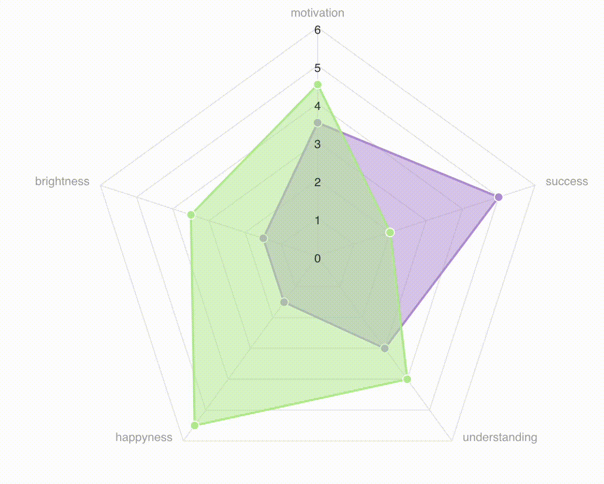

[](https://github.com/asantibanez/livewire-charts/releases/)


## Preview




## Demo

https://github.com/asantibanez/livewire-charts-demo

## Installation

You can install the package via composer:

```bash
composer require asantibanez/livewire-charts
```

Next, you must export the package public scripts. To do this run `php artisan vendor:publish` 
and export `livewire-charts:public`. This command will export a `vendor/livewire-charts` folder under the 
`public` directory of your app.  

```bash
php artisan vendor:publish --tag=livewire-charts:public
```

## Requirements

This package requires the following packages/libraries to work:
- `Laravel Livewire v2` (https://laravel-livewire.com/) 
- `Alpine Js` (https://github.com/alpinejs/alpine)
- `Apex Charts` (https://apexcharts.com/)

Please follow each package/library instructions on how to set them properly in your project.

>Note: At the moment, `Apex Charts` is only supported for drawing charts.  

## Usage

Livewire Charts supports out of the box the following types of charts
- Line/Multi Line Chart (`LivewireLineChart` component)
- Pie Chart (`LivewirePieChart` component)
- Column/Multi Line Chart (`LivewireColumnChart` component)
- Area Chart (`LivewireAreaChart` component)
- Radar Chart (`LivewireRadarChart` component)

Each one comes with its own "model" class that allows you to define the chart's data and render behavior. 
- `LivewireLineChart` uses `LineChartModel` to set up data points, markers, events and other ui customizations. 
- `LivewirePieChart` uses `PieChartModel` to set up data slices, events and other ui customizations. 
- `LivewireColumnChart` uses `ColumnChartModel` to set up data columns, events and other ui customizations.
- `LivewireAreaChart` uses `AreaChartModel` to set up data points, events and other ui customizations.
- `LivewireRadarChart` uses `RadarChartModel` to set up data points, events and other ui customizations.

For example, to render a column chart, we can create an instance of `ColumnChartModel` and add some data to it
```php
$columnChartModel = 
    (new ColumnChartModel())
        ->setTitle('Expenses by Type')
        ->addColumn('Food', 100, '#f6ad55')
        ->addColumn('Shopping', 200, '#fc8181')
        ->addColumn('Travel', 300, '#90cdf4')
    ;
``` 

>Note: Chart model methods are chainable 💪 

With `$columnChartModel` at hand, we pass it to our `LivewireColumnChart` component in our Blade template. 

```blade
<livewire:livewire-column-chart
    :column-chart-model="$columnChartModel"
/>
``` 

Next, include the `@livewireChartsScripts` directive next to your other app scripts

```html
<livewire:scripts />
@livewireChartsScripts
```

And that's it! You have a beautiful rendered chart in seconds. 👌


>Note: You can use these charts inside other Livewire components too. Just render them in your Blade template and you
are good to go. 👍 

## LivewireCharts facade

Chart models can also be created using the `LivewireCharts` facade.

```php
LivewireCharts::lineChartModel();
LivewireCharts::multiLineChartModel();
LivewireCharts::columnChartModel();
LivewireCharts::multiColumnChartModel();
LivewireCharts::pieChartModel();
LivewireCharts::areaChartModel();
LivewireCharts::radarChartModel();
```

## Enabling Interactions

To enable click events, you must use the `with[XXX]ClickEvent($eventName)` method present in every model class and 
define a custom `$eventName` that will be fired with the corresponding data when a column/marker/slice is clicked.

```php
$columnChartModel = 
    (new ColumnChartModel())
        ->setTitle('Expenses by Type')
        ->withOnColumnClickEventName('onColumnClick')
    ;
``` 
 
 Here we define an `onColumnClick` event that will be fired when a column is clicked in our chart. 
 
 We can listen to the `onClickEvent` registering a listener in any other Livewire component.
 
 ```php
 protected $listeners = [
     'onColumnClick' => 'handleOnColumnClick',
 ];
 ``` 

## "Reactive" Charts

You can use livewire-charts components as nested components in you Livewire components. Once rendered, charts will
not automatically react to changes in the `$model` passed in. This is just how Livewire works. 

However, to enable "reactivity" when data passed in changes, you can define a special `$key` 
to your components so they are fully re-rendered each time the chart data changes. 

Each model class comes with a `reactiveKey()` method that returns a string based on its data. If any of the properties
are changed, this key will update accordingly and re-render the chart again.

In the following example, a parent component houses both column chart and pie chart and defines a `$model` for each one. 
The parent component renders the charts as follows

```blade
<livewire:livewire-column-chart
    key="{{ $columnChartModel->reactiveKey() }}"
    :column-chart-model="$columnChartModel"
/>

<livewire:livewire-pie-chart
    key="{{ $pieChartModel->reactiveKey() }}"
    :pie-chart-model="$pieChartModel"
/>
``` 

 When the parent component changes their respective models, charts will automatically re-render itself.
 
 
 
## Charts API

For each chart, a specific model class needs to be used. Here, it is detailed the api available
for each type of chart.

### All

| Method | Description |
|--------|-------------|
| setTitle(string $title) | Sets chart title |
| setAnimated(boolean $animated) | Enables/disables animation |
| setDataLabelsEnabled(boolean $enabled) | Enables/disables data labels |
| withDataLabels() | Enables data labels |
| withoutDataLabels() | Disables data labels |
| withLegend() | Shows legends |
| withoutLegend() | Hides legends |
| setColors(array $colors) | Set colors for chart |
| addColors(string $color) | Append $color to $colors set |
| setXAxisCategories(array $categories) | Enables custom categories for chart X Axis |
| sparklined() | Enables Apex Charts sparkline feature |
| setSparklineEnabled(boolean $isEnabled) | Enables/Disables Apex Charts sparkline feature |

### LivewireLineChart

| Method | Description |
|--------|-------------|
| multiLine() | Adds multiline support for line chart |
| singleLine() | Adds single support for line chart |
| addPoint(string $title, double $value, array $extras = []) | Adds a point to a single line chart. `$extras` is forwarded on click event |
| addSeriesPoint(string $seriesName, string $title, double $value, array $extras = []) | Adds a point to series to a multi line chart. `$extras` is forwarded on click event |
| addMarker(string $title, double $value) | Adds a marker point to the line chart. Markers are used to emphasize particular points in the chart (singleLine only) |
| withOnPointClickEvent(string $eventName) | Event Name that will be fired when a point/marker of the chart is clicked |

### LivewireColumnChart

| Method | Description |
|--------|-------------|
| setOpacity(int $opacity) | Sets columns' opacity |
| setColumnWidth(int $columnWidth) | Sets columns' width |
| setHorizontal(boolean $value) | Sets columns or bars |
| multiColumn() | Sets chart to display multiple column series |
| singleColumn() | Sets chart to display a single column series |
| stacked() | Sets chart to display column series stacked |
| addColumn(string $title, double $value, string $color, array $extras = []) | Adds a column to the chart with the specified color. `$extras` is forwarded on click event |
| addSeriesColumn(string $seriesName, string $title, double $value, array $extras = []) | Adds a column to a multicolumn chart. `$extras` is forwarded on click event |
| onColumnClickEventName(string $eventName) | Event Name that will be fired when a column of the chart is clicked |

### LivewirePieChart

| Method | Description |
|--------|-------------|
| setOpacity(int $opacity) | Sets slices' opacity |
| addSlice(string $title, double $value, string $color, array $extras = []) | Adds a slice to the chart with the specified color. `$extras` is forwarded on click event |
| withOnSliceClickEvent(string $eventName) | Event Name that will be fired when a column of the chart is clicked |

### LivewireAreaChart

| Method | Description |
|--------|-------------|
| addPoint(string $title, double $value, array $extras = []) | Adds a point to the area chart. `$extras` is forwarded on click event |
| withOnPointClickEvent(string $eventName) | Event Name that will be fired when a point of the chart is clicked |
| setXAxisVisible(boolean $visible) | Shows/hides xAxis labels |
| setYAxisVisible(boolean $visible) | Shows/hides yAxis labels |

### LivewireRadarChart

| Method | Description |
|--------|-------------|
| addSeries(string $seriesName, string $title, double $value, array $extras = []) | |
| withOnPointClickEvent(string $eventName) | Event Name that will be fired when a point of the chart is clicked |

## Advanced Usage - Integrating Scripts

The directive `@livewireChartsScripts` adds a `script` tag that includes `public/vendor/livewire-charts/app.js`.
If you want to include this script in your build system, you can export the package scripts 
with `php artisan vendor:publish` and selecting `livewire-charts:scripts`. This will export `js/vendor/livewire-charts`
inside your resources folder. You can then adjust imports as you see fit in your project.

>Note: You must remove @livewireChartsScripts directive so it doesn't clash with the scripts in your build system. 

## Troubleshooting

Chart components must be placed inside a container with fixed height. This is because the chart will use all the given
vertical space. A fixed height is needed to render properly.

 ```blade
<div style="height: 32rem;">
    <livewire:livewire-column-chart .../>
</div>
 ``` 

>Note: if a fixed height is not given, the chart will grow vertically infinitely. That's not what we want, right?

## Testing

``` bash
composer test
```

## Changelog

Please see [CHANGELOG](CHANGELOG.md) for more information what has changed recently.

## Contributing

Please see [CONTRIBUTING](CONTRIBUTING.md) for details.

### Security

If you discover any security related issues, please email santibanez.andres@gmail.com instead of using the issue tracker.

## Credits

- [Andrés Santibáñez](https://github.com/asantibanez)
- [All Contributors](../../contributors)

## License

The MIT License (MIT). Please see [License File](LICENSE.md) for more information.
